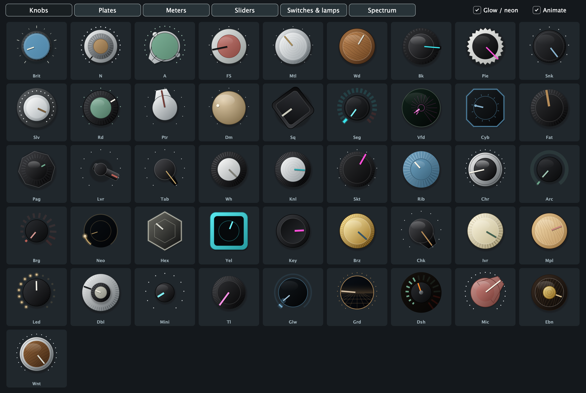
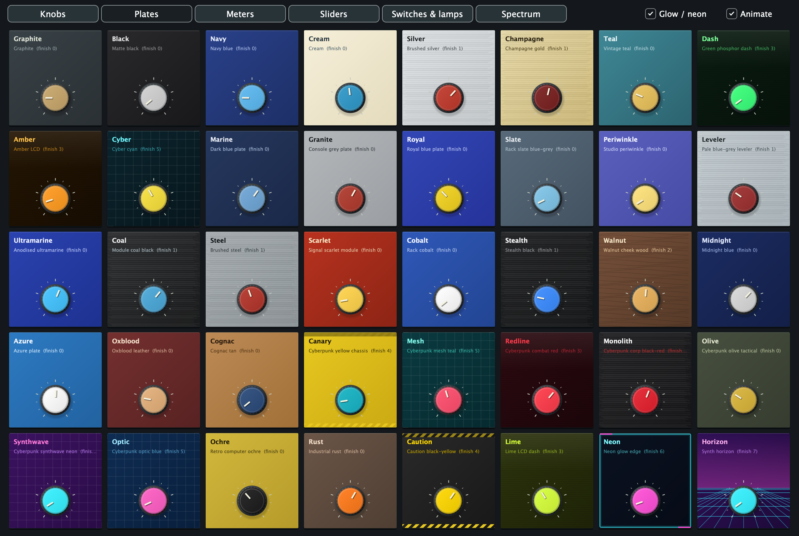
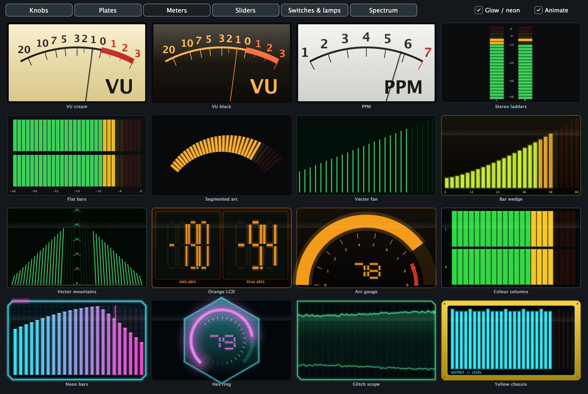
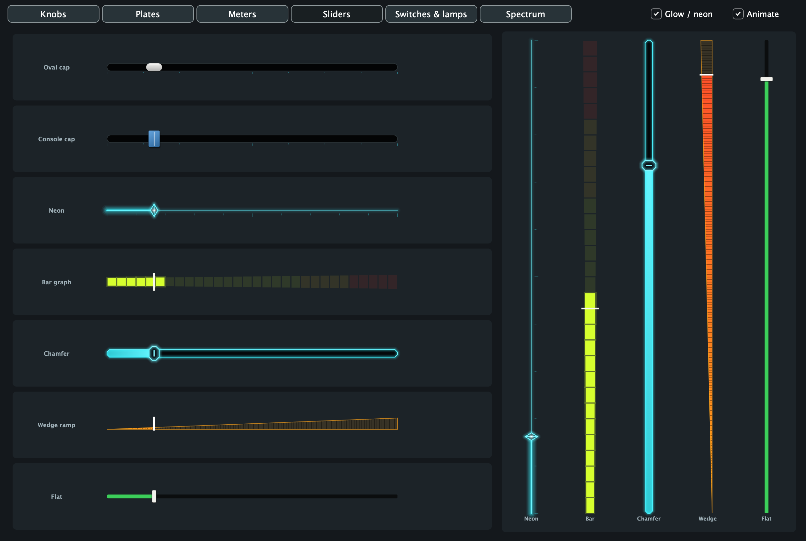
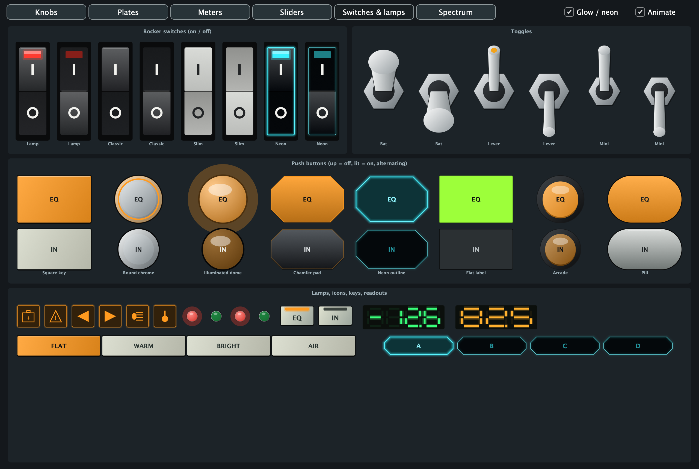
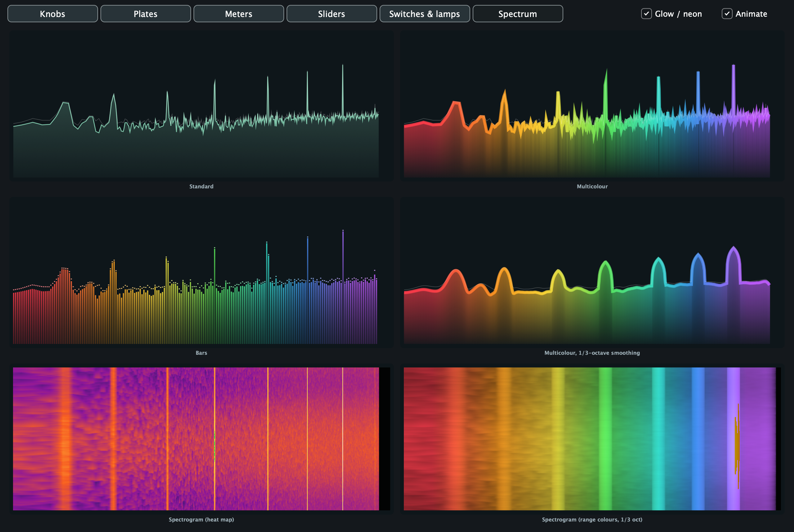

# GoodLookinUI

An independent C++20 toolkit for generated analogue-hardware and retro-futuristic interfaces for audio plugins and tools. It contains no plugin: it is meant to be used by plugins, which live in their own repositories. This is an early implementation, not a finished framework.

## Screenshots

Everything below is generated in code (no bitmaps) and rendered by the gallery app in `examples/gallery`
(`GoodLookinUI Gallery --screenshots <folder>` regenerates these images).

### 46 knobs


### 40 plates, with surface finishes


### Meters: professional hardware, 80s dash and cyberpunk


### Sliders


### Switches, push buttons, lamps and readouts


### Spectrum analyser looks, smoothing and spectrogram


## Implemented

- JUCE-free design model, strict versioned CSV reader/writer and critically damped display motion.
- 47 procedural knob classes (`knobStyles` in `Design.h`, drawn in `adapters/juce/Knobs.h`): console-style (Brit, N, A, FS, Rd, Pie, Chr...), material (Mtl, Wd, Mpl, Bk, Brz, Ivr...), pointer/lever (Ptr, Chk, Lvr, Tab...) and digital/neon (Seg, Vfd, Cyb, Arc, Brg, Neo, Hex, Yel, Led, Glw, Grd, Dsh), crown pointer knobs (A, Mic), wood (Wd, Mpl, Ebn, Wnt) and the small fluted rack-unit knob (Rck). Legacy names `console`, `metal`, `bakelite`, `ivory` still load. Each knob has its own colour.
- 40 plate looks (`faceplates` in `Design.h`) with brushed, wood-grain, scanline, hazard, grid, neon-edge and synth-horizon finishes.
- Meters, lamps, keys and sliders: VU and PPM needles, LED ladders, flat bars, 80s-dash faces (bar wedge, vector mountains, orange LCD, arc gauge, colour columns) and cyberpunk faces (neon bars, hex ring, glitch scope, yellow chassis), 7-segment readouts, icon lamps and oval / console / neon / bar / chamfer / wedge / flat sliders (`adapters/juce/Meters.h`, `Retro.h`). `retro::glowEnabled` switches the retro parts between neon and clean flat drawing.
- Spectrum analyser (JUCE-free, `include/goodlookinui/Spectrum.h`): wait-free sample ring, real-input FFT with a Hann window calibrated to dBFS, tilt, fall-off, peak hold and a log-axis column reducer; `adapters/juce/SpectrumRenderer.h` draws Standard, Multicolour and Bars looks with a colour per frequency range. The FFT runs on the UI thread only (about 0.1 ms for 16384 points).
- Rocker switches (4 styles), toggles (3) and push buttons (8 styles: square, round chrome, illuminated dome, chamfer, neon, flat, arcade, pill) plus radio key banks (`adapters/juce/Switches.h`).
- Fractional-octave smoothing (on display columns, so peaks stay centred) and a spectrogram waterfall with heat-map or per-range colours.
- A gallery window (`adapters/juce/Gallery.h`, example app in `examples/gallery`, `--selftest` renders and checks every page) that shows every part with its code name.
- Lock-free level tap (`include/goodlookinui/LevelTracker.h`) and an editable per-parameter look table (`include/goodlookinui/LookTable.h`).
- Printed knob marks follow the plate: `marks` = auto (dark marks on light plates, light on dark), light or dark, saved as an optional 11th CSV column (older 10-column files still load) and set from the inspector.
- Developer-mode autosave (`adapters/juce/DesignFiles.h`, `include/goodlookinui/Settings.h`): every inspector change is written straight into a folder of your project (for example `Designs/`) as plain CSV, debounced, atomically, and only when the text really changed, keeping each file's existing line endings, so `git diff` shows exactly what you changed and there is no Save button. Settings that are not per-knob (trigger mode, meter face, spectrum ...) go to a small key/value `Settings.csv`. A developer build starts from those files, so a relaunch shows the saved design without a rebuild.
- Development-only inspectors (`Studio.h`, `LookStudio.h`, `SpectrumStudio.h`): knob style, label, colour wheel, font, position and size apply immediately; section looks and spectrum settings are saved per choice.
- Development-only inspector: style, label, hex colour, font size, position, dimensions, save/load and undo.
- Integration helpers that keep a host plugin's parameter IDs and attachments unchanged, with proportional scaling and a compiled design file.

The design inspector edits the knobs a host registers with it. Positions are relative to their containing panel. It does not yet add controls, edit menus, drag controls or move them between panels.

## Dependencies

| Part | Requirements | License |
| --- | --- | --- |
| Core design model, CSV and motion | C++20 standard library | MIT |
| Optional renderer and inspector | JUCE `juce_gui_basics`; verified with JUCE 8.0.4 | Adapter: MIT; JUCE: separate terms |
| Build configuration and checks | CMake 3.22+ and a C++20 compiler | Build tools keep their own licenses |

No third-party bitmap assets, fonts, icon packs, or other libraries are bundled.
JUCE is supplied by the integrating project; this repository does not download,
vendor or fork it. No JUCE license is needed for the independent core.
See [dependency and licensing notes](docs/DEPENDENCIES.md).

## Getting started

```sh
git clone https://github.com/MistaMin/GoodLookinUI.git
cd GoodLookinUI
cmake -S . -B build -DGOODLOOKINUI_BUILD_TESTS=ON -DCMAKE_BUILD_TYPE=Debug
cmake --build build
ctest --test-dir build --output-on-failure -C Debug
```

This core build works without JUCE. [Integration guide](docs/INTEGRATION.md)
contains CMake examples, renderer use and developer-editor setup.

## Build with JUCE

Supply JUCE targets before adding this directory with `add_subdirectory`. Link `goodlookinui_juce` for the adapter or `goodlookinui` for the dependency-free core. Include `GoodLookinUI.h` or `goodlookinui/Design.h` respectively. JUCE is not vendored or forked.

Add this directory to a plugin project (as a git submodule, or as a sibling checkout selected by a CMake variable of your own) and link `goodlookinui_juce`. The toolkit does not build or ship any plugin. Developer builds define `GOODLOOKINUI_ENABLE_EDITOR=1` to include the inspectors; release builds compile them out. In a developer build, open the inspector from your plugin, select a knob and edit its properties; changes apply immediately. Save the design as CSV and embed it in your plugin's build.

## Verify the core without JUCE or CMake

```sh
clang++ -std=c++20 -Wall -Wextra -pedantic -I include tests/core.cpp -o /tmp/goodlookinui-tests
/tmp/goodlookinui-tests
```

Core checks cover CSV roundtrips with commas and quotes, rejected malformed geometry, duplicate IDs and stable motion. The integration has passed Clang syntax checks with JUCE 8.0.4 in both editor modes. Debug and Release standalone, VST3 and AU builds pass on Apple Silicon/macOS. The standalone applications have been launched; generated controls and the development inspector have been visually inspected. Live label/colour edits, undo and CSV save/load were exercised through the native UI. The Release application has no Design button. DAW audio and automation testing remain outstanding.

## Next milestones

See [the implementation plan](docs/IMPLEMENTATION.md). GoodLookinUI is MIT licensed.

## Console-style appearance

The first complete appearance built with this toolkit is a vintage-console-inspired panel: brown/blue/green/red EQ caps, cream filter knobs, aligned strips, physical choice keys with dropdowns, generated fader caps and an inset response display. The toolkit stays independent of any DSP.

Existing CSV designs with the original HardwareUI header can still be loaded. Newly saved designs use the GoodLookinUI header.

## License

GoodLookinUI source code and documentation are released under the [MIT License](LICENSE), copyright 2026 Marcos Deida. This covers the core and JUCE adapter; JUCE and other external dependencies retain their own licenses.
